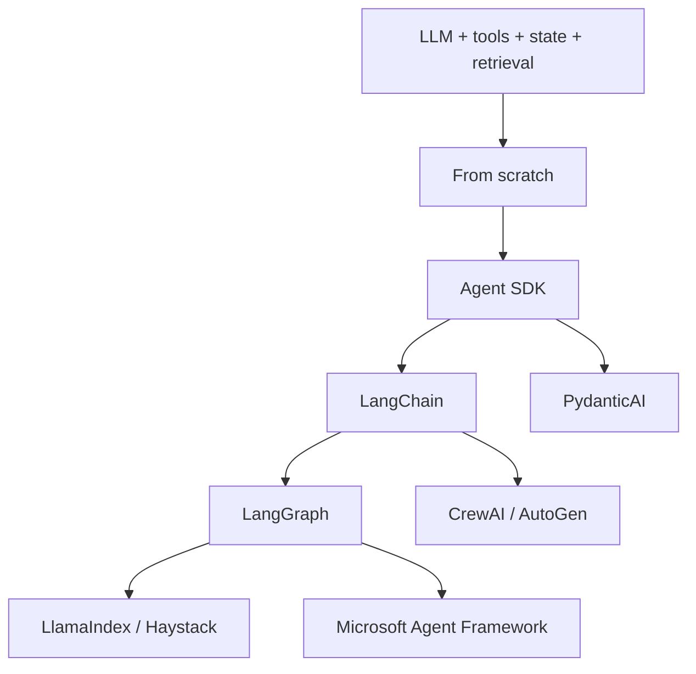
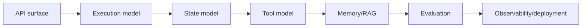

# 11 — Frameworks: Visual Study Guide

## Why frameworks?

Frameworks package repeated patterns: model calls, tools, state, workflows, retrieval, memory, observability, and evaluation.



This is a learning sequence, not a ranking.

## Same problem, different abstraction

Use one canonical research assistant:

```text
question → research → retrieve evidence → write draft → verify → cite
```

Implement it:
1. from scratch
2. OpenAI Agents SDK
3. PydanticAI
4. LangChain/LangGraph
5. LlamaIndex or Haystack
6. one multi-agent framework

Then compare the same metrics.

## Framework roles

| Technology | Learn it for |
|---|---|
| OpenAI Agents SDK | lightweight agent runtime, tools, guardrails, handoffs |
| PydanticAI | typed Python agents and structured dependencies |
| LangChain | model/tool integrations and high-level application patterns |
| LangGraph | explicit stateful graphs and durable agent workflows |
| LlamaIndex | ingestion, indexing, retrieval, data-centric applications |
| Haystack | explicit search/RAG pipelines and components |
| CrewAI | role-oriented multi-agent collaboration + controlled flows |
| Microsoft Agent Framework | agents, workflows, sessions, checkpoints, hosting |
| AutoGen | message-oriented multi-agent systems |
| smolagents | small, transparent agent implementations |
| DSPy | programmatic/metric-driven optimization |
| MCP | interoperable tool/resource protocol boundary |

## How to read a framework



For every framework ask:

- What does it hide?
- What does it make easier?
- Where can I insert custom behavior?
- How does restart/retry work?
- How do I test it?
- How do I migrate away from it?

## Example

Take the handwritten agent from Phase 2. Rebuild it with LangGraph. Draw both architectures. Mark which responsibilities moved from your code into the framework. Then inject the same failures and compare behavior.

## Best practices

- Pin versions for experiments.
- Read current official docs.
- Keep provider-specific code isolated.
- Avoid adopting a framework only because a tutorial uses it.
- Measure framework overhead and operational value.
- Preserve an escape hatch to custom code.

## References

- OpenAI Agents SDK: https://openai.github.io/openai-agents-python/
- LangChain: https://docs.langchain.com/oss/python/langchain/overview
- LangGraph: https://docs.langchain.com/oss/python/langgraph/overview
- LlamaIndex: https://docs.llamaindex.ai/
- Haystack: https://docs.haystack.deepset.ai/
- PydanticAI: https://ai.pydantic.dev/
- CrewAI: https://docs.crewai.com/
- Microsoft Agent Framework: https://learn.microsoft.com/en-us/agent-framework/
- AutoGen: https://microsoft.github.io/autogen/stable/
- smolagents: https://huggingface.co/docs/smolagents/index
- DSPy: https://dspy.ai/
- MCP: https://modelcontextprotocol.io/

## Remember
**A framework should buy you meaningful capability or reliability, not replace your understanding of the underlying system.**