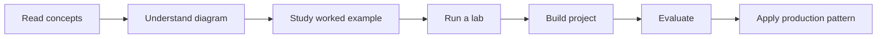

# Visual Section Guides

These pages are the **read-first** layer of the repository. They are designed to explain the concepts before you start coding.

Each guide uses the same structure:

```text
mental model
    ↓
diagram
    ↓
plain-English explanation
    ↓
worked example
    ↓
best practices
    ↓
references
```

## Guides

1. [00 — Foundations](00-foundations.md)
2. [01 — LLM Engineering](01-llm-engineering.md)
3. [02 — Model APIs](02-model-apis.md)
4. [03 — Tools](03-tools.md)
5. [04 — Agents](04-agents.md)
6. [05 — Memory](05-memory.md)
7. [06 — RAG](06-rag.md)
8. [07 — Orchestration](07-orchestration.md)
9. [08 — Evaluation](08-evaluation.md)
10. [09 — Observability](09-observability.md)
11. [10 — Production](10-production.md)
12. [11 — Frameworks](11-frameworks.md)

## How to use them

Read the section guide first. Then read the section README, run the examples, complete a lab, and finally build the project.

The intended progression is:


