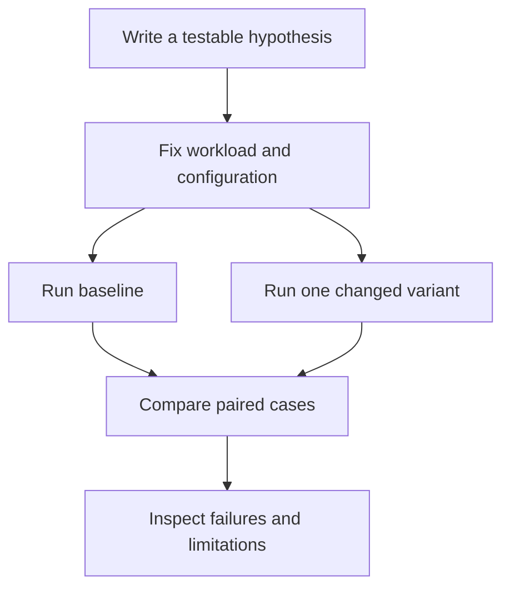

# Labs: learn to run a controlled experiment

[Lab catalog](README.md) · [Offline examples](../LEARNING-PATH.md)

## Worked example — change one cause

Question: does adding reranking improve evidence recall or just the order of existing candidates? Hold the corpus, queries, candidate generator, top-k, and relevance labels fixed. Compare candidates before and after reranking. A reranker cannot recover an item absent from its input, but it can improve which candidates appear in the final top-k.

Distinguish an experiment from a demo: a demo shows one successful execution; an experiment has a question, controlled variables, measurements, and limitations. Repeat live-model experiments enough to observe variability. Do not label arithmetic fixtures as provider benchmarks.

## Exercise 1 — context-window distraction

Create six synthetic question/evidence pairs and two deliberately unrelated passages. Compare relevant evidence alone against the same evidence plus distractions. Define correctness and unsupported-claim checks before running. If no live model is available, finish the fixtures and mark the results “not run.”

**Deliverable:** one table with case ID, expected behavior, baseline output, variant output, correctness, tokens, and notes. Do not populate results from expectation.

## Exercise 2 — concurrency study

Use [the bounded async example](../00-foundations/examples/bounded_async.py) to predict behavior at limits 1, 2, and 3. Then measure repeated runs with a monotonic clock if you want a timing experiment. This fixture measures local scheduling and simulated wait overlap, not real provider throughput.

**Expected interpretation:** a higher limit overlaps more waits, but does not establish that a real server can sustain that rate. Report peak activity, elapsed samples, and simulated workload assumptions.

## Quiz

1. Why hold the corpus fixed? **A** Reduce confounding; **B** Guarantee improvement; **C** Avoid labels.
2. Can expected results be reported as measured? **A** Yes; **B** No; **C** If plausible.
3. Can a reranker recover a missing candidate? **A** Always; **B** With any score; **C** Not unless another retrieval step supplies it.
4. What should accompany a result? **A** Only a screenshot; **B** Configuration, raw observations, and limitations; **C** Only a claim.
5. Does local simulated wait time prove API throughput? **A** No; **B** Yes; **C** Only in Python.

Answers

1. **A** — changing data and method together obscures the cause.
2. **B** — keep hypotheses and observations distinct.
3. **C** — reranking only orders its supplied candidates.
4. **B** — reproducibility requires context and evidence.
5. **A** — the fixture does not exercise provider capacity or networking.

