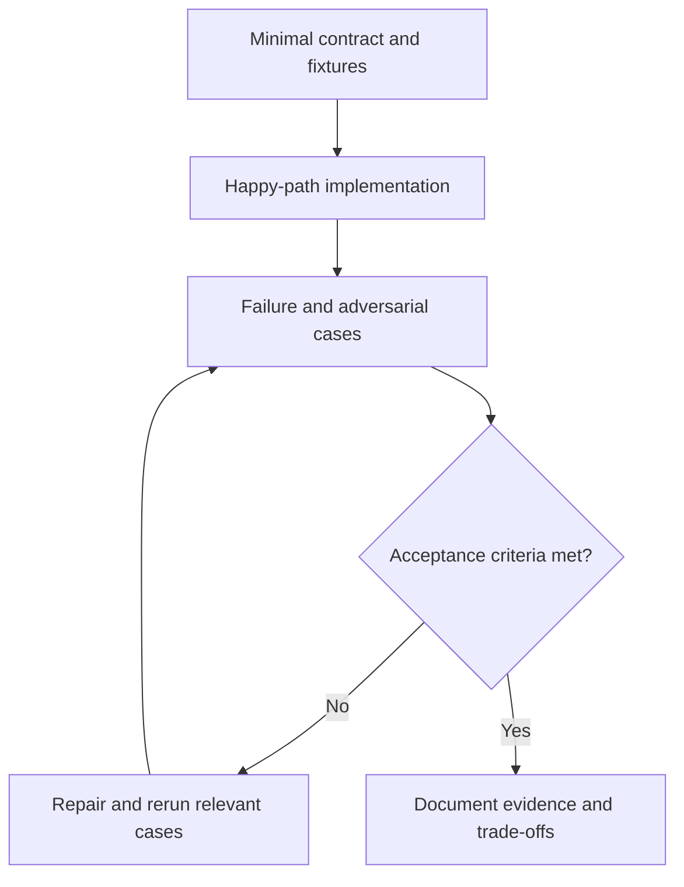

# Capstone exercises and review quiz

[Project catalog](README.md) · [Learning path](../LEARNING-PATH.md)

Build in increments. Each capstone adds one responsibility to an already tested baseline. Use synthetic fixtures first, then configure live integrations deliberately. These are project assignments with acceptance criteria, not claims that the full systems are already implemented.

## Seven project exercises

| Project | Small first implementation | Failure to inject | Completion evidence |
|---|---|---|---|
| 1. LLM CLI | Read a question, call an adapter, display output | Stream disconnect | Partial output marked incomplete; error visible |
| 2. Tool agent | Lookup plus a bounded loop | Unknown tool and repeated call | No arbitrary dispatch; hard stop recorded |
| 3. RAG assistant | Three documents and cited answer | Missing evidence and wrong tenant | Abstention and no private content exposure |
| 4. Stateful research agent | Persist question, evidence, and next step | Restart after retrieval | Resume without losing source IDs |
| 5. Workflow orchestrator | Branch, join, and approval pause | Duplicate callback | One atomic claim and version-bound approval |
| 6. Multi-agent research | Bounded researcher, writer, reviewer | Conflicting specialist outputs | Deterministic merge and preserved disagreements |
| 7. Production service | Admission, queue, state, telemetry | Provider outage and overload | Bounded work, degraded response, recovery report |

### Worked example — project 3

Use a current refund policy, an obsolete policy, and a shipping policy. Add source IDs and versions. Ask one answerable refund question, one shipping question, and one question absent from the corpus. The first two should cite eligible current evidence; the third should abstain. Then add another tenant's document containing an attractive exact answer and confirm it never enters model context.

A passing demo answers one question. A completed learning project also explains the access boundary, runs the failure fixtures, records evaluation, and states limitations. Add a live model only after the deterministic retrieval and scoping checks work.

## Exercise — write a capstone report

Choose one row. Write requirements, an architecture diagram, exact setup/run commands, expected fixture output, measured observations, failure recovery, and one alternative design. Explain what remains unimplemented. For the n8n project, use its [walkthrough](personal-ai-assistant-n8n/LEARNING-WALKTHROUGH.md) and do not treat its manifests as importable workflows.

**Pass criteria:** another learner can reproduce the offline portion, identify each boundary, and distinguish finished work from future tasks.

## Quiz

1. What should come before multi-agent complexity? **A** A measured baseline; **B** A large number of roles; **C** Unlimited tools.
2. What makes a citation useful? **A** Its length; **B** Its source supports the claim; **C** Its color.
3. Which is evidence of restart recovery? **A** A diagram only; **B** One uninterrupted run; **C** A fault followed by a correct resumed run.
4. Should a report hide unimplemented features? **A** No; **B** Yes; **C** Only before release.
5. What should conflicting specialist claims preserve? **A** Only the loudest answer; **B** Evidence and unresolved disagreement; **C** Random selection.

Answers

1. **A** — complexity should address an observed need.
2. **B** — a source ID alone does not prove support.
3. **C** — recovery requires exercising interruption and persistence.
4. **A** — honest boundaries make the artifact usable.
5. **B** — a merge should not erase uncertainty or provenance.

