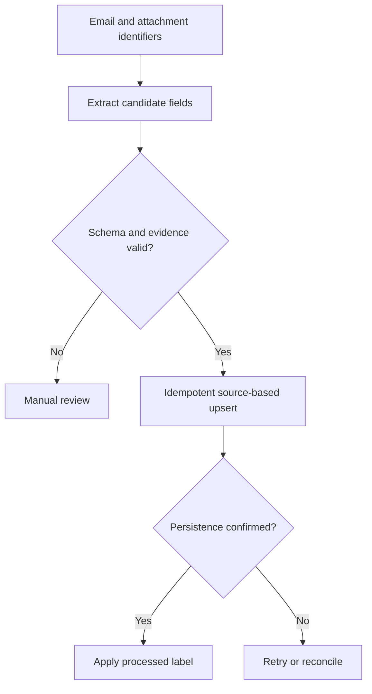
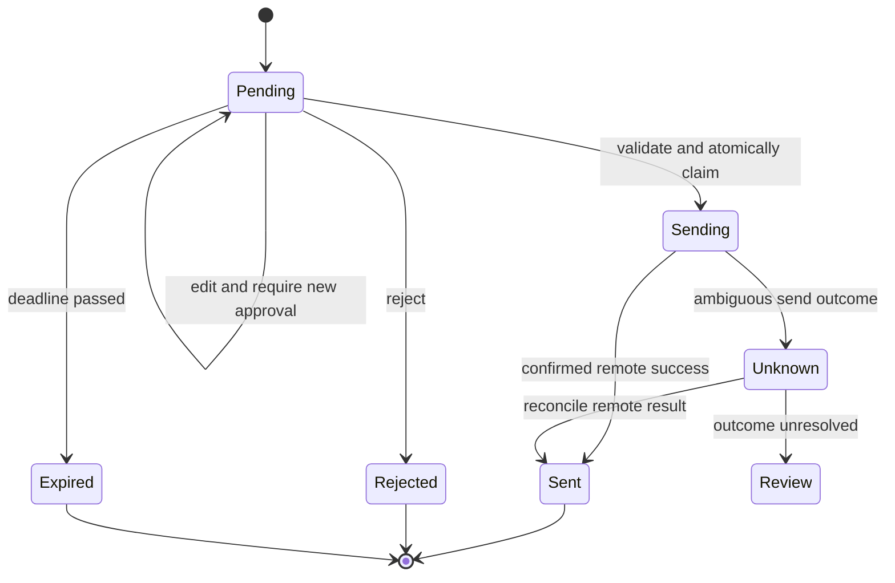

# Personal assistant: learn the workflow before connecting accounts

[Project home](README.md) · [Implementation reference](docs/implementation.md)

The existing node manifests describe intended logic; they are not native, directly importable n8n workflow exports. This walkthrough is a design lab using synthetic inputs. It does not deploy n8n or connect Gmail, Telegram, or Google Tasks.

## 1. Deployment and credentials

A container can be recreated; its credential database and encryption key must remain recoverable according to the deployment's documented backup design. Keep credentials in the workflow platform's credential store and inject configuration outside Git. Test a restore in an isolated environment before trusting the backup. Restrict editor access and use the current official hosting instructions for the selected n8n version.

## 2. Bill extraction: from text to evidence-backed fields

Synthetic input: “Acme Water invoice W-17. Amount due USD 42.50. Due 2026-10-15.” Expected fields are biller `Acme Water`, amount `42.50`, currency `USD`, due date `2026-10-15`, and payment status `unknown` unless the source explicitly establishes a status. An amount due is not a receipt proving payment.

Validate schema, then verify each field against source evidence. Use decimal arithmetic or integer minor units for money in application logic. Missing currency stays null; “$” alone can be ambiguous. Do not infer a year when a date is incomplete unless a documented deterministic rule and appropriate review permit it.

The processed marker follows successful persistence, so a storage error does not hide an unprocessed bill. Prefer stable source identifiers for deduplication; including variable model-extracted text in a key can create a new record when a later extraction changes wording. Multiple invoices in one message need stable attachment/document or invoice identities, with review for ambiguous splits.

## 3. Drafts and human approval

Drafting and sending are separate actions. Persist recipient, subject, body, draft ID, exact content hash/version, owner, expiration, and approval status. A Telegram callback carries an opaque approval ID; the server resolves the real action. Check the sender identity as well as the allowed chat, especially when group chats are possible.

Two approve taps must compete for one atomic `pending → sending` claim before the send API call. A later callback must not start another send. If sending succeeds but saving `sent` fails, local status alone cannot establish whether another send is safe. Reconcile remote state or ask for review; do not promise exactly-once sending based on a local flag.

## 4. Daily planner and mobile commands

Treat `/today`, `/bills`, and `/pending` as scoped read requests. Treat an edit or approval as a versioned action. Use the workflow's explicit timezone for dates and preserve the distinction between calendar dates and timestamps. Keep task creation rules deterministic and deduplicate by source plus stable action identity. The LLM may summarize priorities but should not invent dates or commitments.

## 5. Operations and recovery

Log message/action IDs, status, safe error category, and timings. Avoid raw mailbox contents and tokens in logs. Inject an extraction failure, a database outage, an expired callback, and a send timeout in a test environment. Confirm that none silently skips work or causes unapproved sending. The existing “zero-hallucination” goal is a risk-reduction target, not a guarantee; schema correctness does not prove factual accuracy.

## Exercise — build a failure table

Use four fixtures: complete invoice, missing currency, malicious instructions inside an email, and an edited draft with an old approval. For each, write extracted fields, expected state, allowed external action, and recovery step. Add a duplicate approve callback and an unknown send result.

**Acceptance:** missing facts stay null; hostile text cannot grant authority; changed drafts require new approval; one callback claims a send; unknown outcomes enter reconciliation.

Worked outcomes

A complete invoice may be persisted after validation. Missing currency requires null/review according to the application's requirements. Injection remains untrusted email content. An old approval cannot authorize a changed draft. A duplicate callback observes the claimed state and does not resend. An ambiguous send timeout requires remote reconciliation or manual review.

## Quiz

1. When should a message receive its processed marker? **A** Before extraction; **B** After confirmed persistence; **C** After any failure.
2. Does JSON validity prove the amount was on the invoice? **A** Yes; **B** Only at low temperature; **C** No.
3. Which transition must happen before sending? **A** Atomic pending-to-sending claim; **B** Sent-to-pending; **C** None.
4. Does an approval for draft version 1 cover edited version 2? **A** Always; **B** Not without a valid policy/new approval; **C** Only if longer.
5. What should an unknown send outcome trigger? **A** Unlimited resend; **B** Mark unsent automatically; **C** Reconciliation or review.

Answers

1. **B** — persistence must succeed before marking source work complete.
2. **C** — evidence validation is separate from shape validation.
3. **A** — competing callbacks must not independently dispatch the same action.
4. **B** — authorization must bind to the content actually sent.
5. **C** — the remote service may already have sent the message.

## References

- [n8n documentation](https://docs.n8n.io/): consult current deployment and node instructions.
- [Tool idempotency lesson](../../03-tools/DEEP-DIVE.md).
- [Workflow crash recovery](../../07-orchestration/DEEP-DIVE.md).
