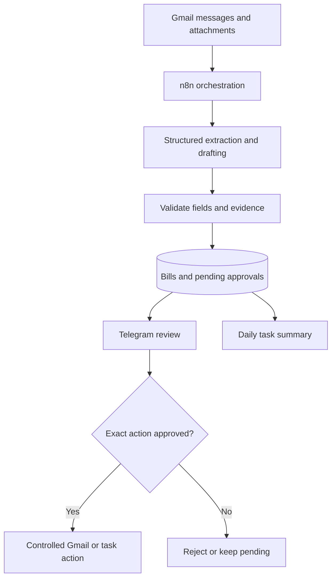

# Self-Hosted Personal AI Assistant with n8n

A security-first reference implementation for a self-hosted personal assistant using Docker + n8n, Gmail, Google Tasks, Telegram, and a structured-output LLM.

## Architecture

Read the approval branch as an application-enforced state transition. Model output alone cannot authorize sending.

## Safety boundary

- LLMs classify/extract/draft; they do not autonomously send email.
- Gmail sending is a separate action reachable only after explicit Telegram approval.
- Telegram callback payloads contain opaque IDs, not email body text.
- Secrets live in Docker environment/secret storage, never in workflow JSON or Git.
- Treat email and attachments as untrusted input; never let their text override the extraction system prompt.

## Phases

1. Foundation: deploy n8n, persist data, create encryption key, restrict ingress.
2. Connections: configure Gmail, Google Tasks, Telegram, and one LLM provider.
3. Workflow A: bill/invoice extraction.
4. Workflow B: email triage + draft + Telegram HITL.
5. Workflow C: morning agenda + Google Tasks.
6. Hardening: allowlist Telegram chat ID, idempotency, audit logs, backups, rate limits.
7. Operations: monitoring, error workflow, credential rotation, restore drills.

See docs/implementation.md for exact configuration and prompts.
See schemas/llm-schemas.json for extraction/triage schemas.
See workflows/node-manifests.json for node-by-node implementation logic.
See docker-compose.yml and .env.example for deployment.

## Guided learning and practice

Read the [learning walkthrough](LEARNING-WALKTHROUGH.md) for invoice examples, approval-state diagrams, failure exercises, and a five-question quiz. The node manifests are design references, not directly importable n8n workflow exports.
