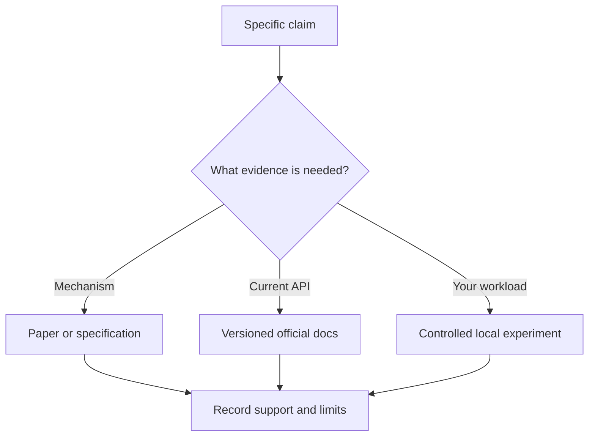

# Resources: reading and verification exercises

[Resource catalog](README.md) · [Learning path](../LEARNING-PATH.md)

## Read with a question

Before opening a long paper or documentation page, write one question you need answered. For a paper, identify its research question, method, dataset, baseline, result, and limitation. For API documentation, identify the exact package/version, feature contract, error behavior, and minimal reproducible example. A tutorial's successful demo is not proof of general superiority.

### Worked example

The transformer paper explains an architecture and evaluates particular experiments. It does not directly establish the accuracy, pricing, or latency of a current hosted model. Current provider docs define an interface, while your own evaluation establishes behavior on your task. Keep these evidence types separate.

## Exercise — one source card

Read one primary source already linked in the repository. Write: title/URL, access date, version if relevant, one supported claim, one limitation, and one small reproduction exercise. Paraphrase instead of copying a large passage. If a link fails, locate the new official page and record the change; do not substitute an unrelated mirror without explanation.

**Pass criteria:** the source actually supports the claim; dated API facts are identified as such; the proposed experiment can fail as well as succeed.

## Quiz

1. Best source for current API parameters? **A** Official versioned docs; **B** An undated screenshot; **C** A guess.
2. Does a paper's benchmark prove your application will be faster? **A** Yes; **B** No; **C** Only if popular.
3. What should a source card include? **A** Only its title; **B** Only a quote; **C** Claim, evidence, date/version, and limitation.
4. What should you do with conflicting sources? **A** Ignore the conflict; **B** Compare scope, versions, and primary evidence; **C** Pick the longer one.
5. Which is a measured observation? **A** A predicted result; **B** A marketing claim; **C** Recorded output from a specified experiment.

Answers

1. **A** — interfaces evolve and version context matters.
2. **B** — workloads, implementations, and environments differ.
3. **C** — a useful note connects support to its limits.
4. **B** — apparently conflicting claims may concern different conditions.
5. **C** — prediction is a hypothesis until observed.

