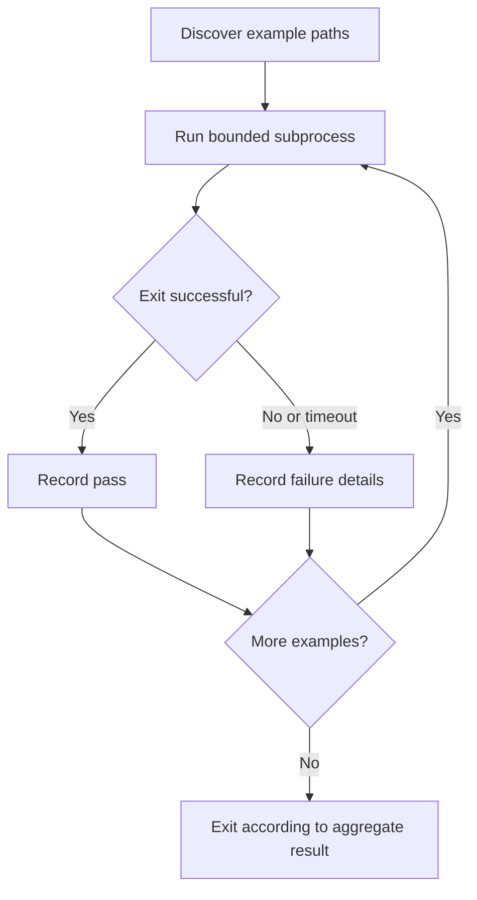

# Scripts: reliable automation exercise

[Scripts overview](README.md) · [Learning path](../LEARNING-PATH.md)

## Runnable entry point

From the repository root, run:

```bash
python scripts/run_learning_examples.py
```

This discovers numbered-section Python examples, runs each in a subprocess with the same interpreter, prints its output, applies a 15-second limit, and exits nonzero if any example fails. It uses only the standard library and does not call external APIs. The other utility names in the original scripts catalog are project suggestions, not implemented commands.

## Why these choices matter

Using the current interpreter avoids accidentally running examples under a different environment. Resolving paths relative to the script makes execution independent of the caller's directory. A timeout prevents a broken example from hanging the whole run. Capturing errors and returning a nonzero exit code lets CI distinguish success from a report that merely printed something.



## Exercise — make failure observable

In a temporary working copy, change an example assertion so it fails. Run the runner and inspect its exit status using your shell. Restore the example and rerun. Then inspect how an empty discovery result is handled.

**Pass criteria:** the failed example appears in output, the process exits nonzero, and the restored run passes. Do not commit the intentional fault. A runner that prints an error and exits zero can mislead automated checks.

<details><summary>Expected behavior</summary>

The subprocess emits an assertion traceback, the summary has fewer passes than examples, and the runner exits 1. After restoration, all 12 examples pass. Exit status is part of the command's interface, not just a convenience.

</details>

## Quiz

1. Why use the same Python interpreter? **A** Consistent environment; **B** Automatic cloud access; **C** Infinite memory.
2. What should failure return to CI? **A** Always zero; **B** A nonzero exit code; **C** Only a blank line.
3. Why add a timeout? **A** Improve model intelligence; **B** Hide errors; **C** Bound hangs.
4. Where should credentials live? **A** Outside source and ordinary logs; **B** In committed fixtures; **C** In example output.
5. Does the runner validate live model quality? **A** Yes; **B** No, it exercises offline fixture programs; **C** Only on weekdays.

<details><summary>Answers</summary>

1. **A** — it preserves the runtime used to launch the runner.
2. **B** — automation needs a machine-readable failure signal.
3. **C** — a hung child must not block the entire suite indefinitely.
4. **A** — keep fixtures synthetic and secret-free.
5. **B** — live integrations need separate explicit configuration and evaluation.

</details>
